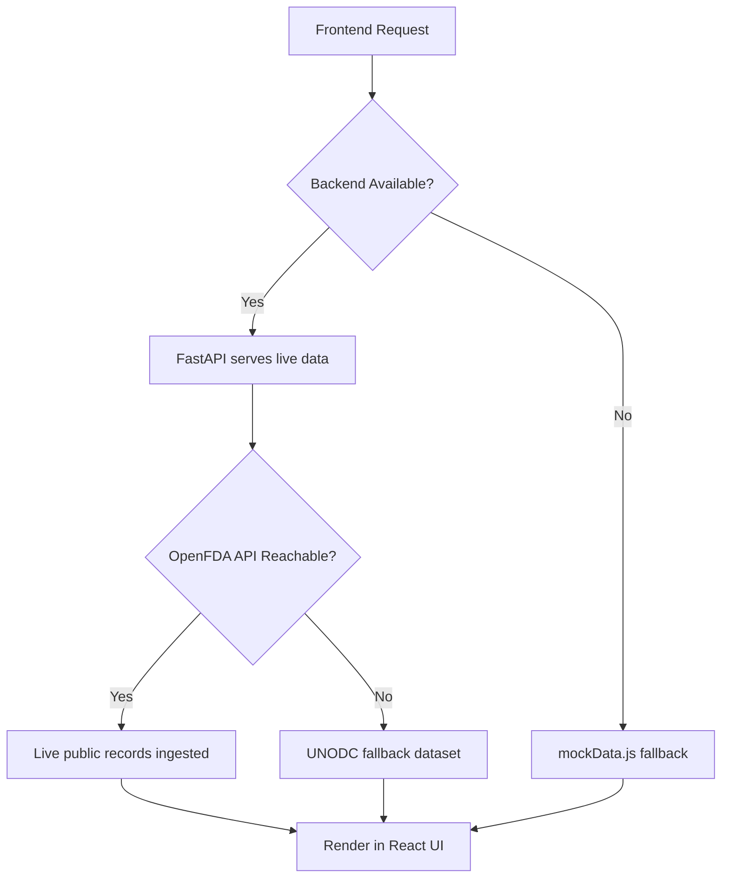
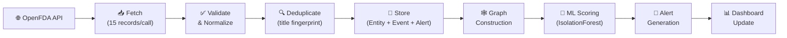
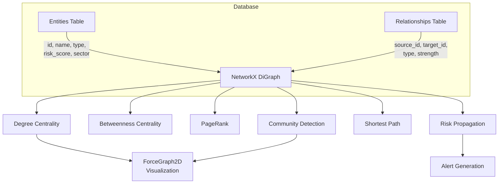
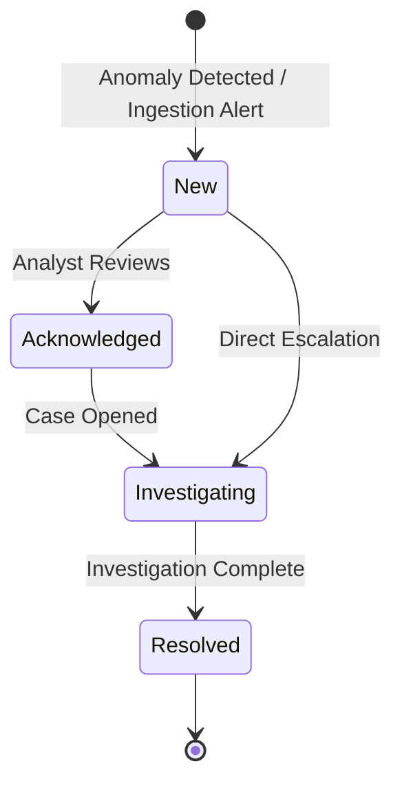

<div align="center">

# 🔬 NARCOSCOPE

### Intelligence-Grade Narcotics Network Analysis Platform

**Real-time graph intelligence · ML-driven anomaly detection · Public open-data ingestion**

[](https://python.org)
[](https://fastapi.tiangolo.com)
[](https://react.dev)
[](https://vite.dev)
[](https://tailwindcss.com)
[](https://scikit-learn.org)
[](https://networkx.org)
[](https://sqlalchemy.org)
[](LICENSE)

<br/>

*A full-stack intelligence platform that combines graph-based network analysis, machine learning anomaly detection, and live public open-data ingestion to model narcotics supply chain interdiction workflows — built as a hackathon prototype demonstrating how modern AI/ML techniques can augment law enforcement decision support.*

</div>

---

## 📋 Table of Contents

- [Vision](#-vision)
- [Core Capabilities](#-core-capabilities)
- [System Architecture](#-system-architecture)
- [Data Pipeline](#-data-pipeline)
- [Data Strategy](#-data-strategy--classification)
- [AI / ML Engine](#-ai--ml-engine)
- [Graph Intelligence](#-graph-intelligence)
- [Anomaly Detection Pipeline](#-anomaly-detection-pipeline)
- [Alert Lifecycle](#-alert-lifecycle)
- [Frontend Architecture](#-frontend-architecture)
- [Backend Architecture](#-backend-architecture)
- [API Reference](#-api-reference)
- [Quick Start](#-quick-start)
- [Configuration](#%EF%B8%8F-configuration)
- [Project Structure](#-project-structure)
- [Demo Workflow](#-demo-workflow)
- [Roadmap](#-roadmap)
- [Team](#-team)

---

## 🎯 Vision

Counter-narcotics operations generate massive volumes of heterogeneous data — enforcement actions, financial trails, logistics movements, informant tip-offs, and open-source intelligence. Analysts face the challenge of connecting disparate signals across organizational silos into actionable intelligence.

**NARCOSCOPE** addresses this by providing a unified decision-support platform that:

1. **Ingests** live public government data (OpenFDA Drug Enforcement API) alongside synthetic demonstration datasets
2. **Constructs** a dynamic entity-relationship graph modeling persons, organizations, vehicles, locations, and financial accounts
3. **Detects** statistical anomalies in sector-level activity using scikit-learn's IsolationForest algorithm
4. **Extracts** entity leads from unstructured text using TF-IDF vectorization and NLP pattern matching
5. **Visualizes** network topology, geographic sector heatmaps, anomaly trends, and investigation timelines through an operator-grade dark-themed React interface

> **Note:** NARCOSCOPE is a hackathon prototype and technical demonstration. All entity networks, relationships, and investigations are synthetic/fictional. The platform integrates real public government APIs to demonstrate live data ingestion capabilities, but no actual law enforcement data is used.

---

## ⚡ Core Capabilities

| Module | Description | Status |
|--------|-------------|--------|
| **Dashboard** | Real-time KPI metrics, risk distribution, sector bar charts, and 6-month trend lines — all dynamically computed from live database state | ✅ Implemented |
| **Network Intelligence** | Interactive force-directed graph (ForceGraph2D) with 150+ nodes, degree centrality calculation, community detection, and entity drill-down | ✅ Implemented |
| **Activity Map** | 12-sector geographic heatmap with baseline vs. observed activity comparison, deviation percentages, and anomaly flagging | ✅ Implemented |
| **Anomaly Detection** | IsolationForest ML model scoring sector activity vectors, producing anomaly flags and confidence scores | ✅ Implemented |
| **OSINT Intelligence** | NLP entity extraction from unstructured text, TF-IDF keyword analysis, risk scoring, and trafficking route prediction | ✅ Implemented |
| **Alerts** | Kanban-style alert management (New → Acknowledged → Investigating → Resolved) with severity classification | ✅ Implemented |
| **Entities** | Searchable entity registry with type filtering, risk scoring, and relationship context | ✅ Implemented |
| **Investigations** | Case management with timeline tracking, linked entities, evidence, and status progression | ✅ Implemented |
| **Reports** | Intelligence briefing summaries with CSV/JSON data export | ✅ Implemented |
| **Live Data Ingestion** | 4-stage pipeline (Fetch → Deduplicate → Score → Complete) pulling from OpenFDA government API | ✅ Implemented |
| **Settings** | Configurable refresh rate, data source preferences, and display options | ✅ Implemented |
| **Auth / RBAC** | JWT-based authentication with role-based access control | 🔲 Scaffolded |
| **Neo4j Graph DB** | Production graph database integration (currently falls back to NetworkX + SQLite) | 🔲 Planned |
| **PostgreSQL** | Production relational database (currently uses SQLite in demo mode) | 🔲 Planned |

---

## 🏗 System Architecture

```
┌─────────────────────────────────────────────────────────────────┐
│                        NARCOSCOPE PLATFORM                      │
├─────────────────────────────────────────────────────────────────┤
│                                                                 │
│  ┌──────────────────────────────────────────────────────────┐   │
│  │                    REACT FRONTEND                        │   │
│  │  Vite 8.2 · React 19 · Tailwind CSS · Recharts · D3     │   │
│  │  ForceGraph2D · React Router · Lucide Icons              │   │
│  │                                                          │   │
│  │  ┌──────────┐ ┌──────────┐ ┌──────────┐ ┌──────────┐   │   │
│  │  │Dashboard │ │ Network  │ │ Activity │ │  OSINT   │   │   │
│  │  │  Page    │ │  Intel   │ │   Map    │ │  Intel   │   │   │
│  │  └──────────┘ └──────────┘ └──────────┘ └──────────┘   │   │
│  │  ┌──────────┐ ┌──────────┐ ┌──────────┐ ┌──────────┐   │   │
│  │  │ Anomaly  │ │  Alerts  │ │Entities  │ │  Invest  │   │   │
│  │  │Detection │ │  Center  │ │ Registry │ │  -ments  │   │   │
│  │  └──────────┘ └──────────┘ └──────────┘ └──────────┘   │   │
│  │                                                          │   │
│  │            api.js (fetchWithFallback)                     │   │
│  │     Live Backend ←→ Mock Data Fallback                   │   │
│  └──────────────────────┬───────────────────────────────────┘   │
│                         │ HTTP REST                              │
│                         ▼                                        │
│  ┌──────────────────────────────────────────────────────────┐   │
│  │                   FASTAPI BACKEND                        │   │
│  │  Python 3.11+ · FastAPI 0.115 · Pydantic v2 · Uvicorn   │   │
│  │                                                          │   │
│  │  ┌─────────────────────────────────────────────────┐     │   │
│  │  │              API ROUTES (13 endpoints)           │     │   │
│  │  │  /dashboard  /network  /map  /entities           │     │   │
│  │  │  /alerts     /anomalies  /investigations         │     │   │
│  │  │  /reports    /osint  /ingestion  /system          │     │   │
│  │  └─────────────────────┬───────────────────────────┘     │   │
│  │                        │                                  │   │
│  │  ┌─────────┐  ┌───────▼──────┐  ┌──────────────────┐    │   │
│  │  │  ML     │  │   Service    │  │  Graph Engine     │    │   │
│  │  │ Engine  │  │    Layer     │  │  (NetworkX)       │    │   │
│  │  │(sklearn)│  │              │  │  • Centrality     │    │   │
│  │  │• IsoFor │  │• external_   │  │  • Communities    │    │   │
│  │  │• TF-IDF │  │  data.py     │  │  • Shortest Path  │    │   │
│  │  │• NLP    │  │• graph_      │  │  • Risk Propagate │    │   │
│  │  └─────────┘  │  service.py  │  └──────────────────┘    │   │
│  │               └──────┬───────┘                           │   │
│  │                      │                                    │   │
│  │            ┌─────────▼─────────┐                         │   │
│  │            │  SQLAlchemy ORM   │                         │   │
│  │            │  7 Models · Alembic│                        │   │
│  │            └─────────┬─────────┘                         │   │
│  └──────────────────────┼───────────────────────────────────┘   │
│                         │                                        │
│              ┌──────────▼──────────┐                            │
│              │    SQLite (Demo)    │   ← DEMO_MODE=True         │
│              │    PostgreSQL       │   ← DEMO_MODE=False        │
│              │    narcoscope.db    │                             │
│              └─────────────────────┘                            │
│                                                                 │
│              ┌─────────────────────┐                            │
│              │  EXTERNAL DATA      │                            │
│              │  OpenFDA REST API   │  ← Live Public Gov Data    │
│              │  api.fda.gov        │                             │
│              └─────────────────────┘                            │
└─────────────────────────────────────────────────────────────────┘
```

### Resilience Architecture

NARCOSCOPE is designed to remain fully functional under degraded conditions:



| Scenario | Behavior |
|----------|----------|
| Full stack running | Live backend data + OpenFDA ingestion |
| Backend offline | Frontend renders with mock data fallback |
| OpenFDA API unreachable | Ingestion falls back to static UNODC public dataset |
| Database empty | Auto-seeds 153 entities, 256 relationships on startup |

---

## 🔄 Data Pipeline

The ingestion pipeline transforms raw public government data into actionable intelligence graph nodes:



### Pipeline Stages in Detail

| Stage | Component | Description |
|-------|-----------|-------------|
| **1. Fetch** | `external_data.py` | HTTP GET to `api.fda.gov/drug/enforcement.json` with randomized `skip` offset to ensure fresh records |
| **2. Validate** | `external_data.py` | Normalizes fields: `recall_number` → `id`, `recalling_firm` → `substance`, `city` → `location` |
| **3. Deduplicate** | `external_data.py` | Deterministic title fingerprint (`OpenFDA — {id} {substance}`) checked against existing event titles |
| **4. Store** | SQLAlchemy ORM | Creates `Event`, `Entity` (distributed across 5 types and 12 sectors), `Relationship`, and `Alert` records |
| **5. Graph** | `graph_service.py` | Builds NetworkX graph from all entities and relationships, computes degree centrality |
| **6. ML Score** | `ml_engine.py` | Runs IsolationForest on sector activity feature matrix `[baseline, observed, deviation%, anomalyScore]` |
| **7. Alert** | `external_data.py` | Auto-generates severity-classified alerts for each new enforcement action |
| **8. Broadcast** | `Sidebar.jsx` | Dispatches `narcoscope_data_updated` browser event → all 7 page components re-fetch live data |

---

## 📊 Data Strategy & Classification

NARCOSCOPE maintains strict data classification to ensure transparency about what is real and what is synthetic:

| Classification | Source | Description |
|---------------|--------|-------------|
| 🟢 **Public / Historical** | OpenFDA Drug Enforcement API (`api.fda.gov`) | Real U.S. government drug enforcement and recall records, freely available via public REST API |
| 🟡 **Public / Statistical** | UNODC Drugs Monitoring Platform | Historical international seizure trend benchmarks (used as fallback) |
| 🔵 **Synthetic / Demonstration** | NARCOSCOPE seed data | Fictional entities, relationships, and investigations generated for demonstration purposes |
| 🟣 **ML Analytics** | scikit-learn models | IsolationForest anomaly scores and TF-IDF NLP extractions computed at runtime |

> **Important:** All persons, organizations, and entity names in the NARCOSCOPE demo network are entirely fictional. No real individuals or organizations are represented. Public data from OpenFDA is official U.S. government data accessed through lawful public API endpoints.

---

## 🤖 AI / ML Engine

NARCOSCOPE implements three distinct ML capabilities using scikit-learn:

### 1. IsolationForest Anomaly Detection

```
Input: Sector activity feature vectors
       [baseline, observed, deviation%, heuristic_score]
            ↓
Processing: sklearn.ensemble.IsolationForest
            n_estimators=50, contamination=0.25
            ↓
Output: Per-sector anomaly flag (bool) + confidence score (0.05–0.98)
            ↓
Usage: Anomaly Detection page severity cards + Dashboard KPI
```

The model fits on a 12-sector × 4-feature matrix and uses the `decision_function` to produce continuous anomaly scores normalized to a 0–1 confidence range.

### 2. TF-IDF + NLP Entity Extraction

```
Input: Unstructured text (tip-offs, intelligence reports)
            ↓
Processing: TfidfVectorizer (top-5 features)
          + Regex pattern extraction (persons, vehicles, locations)
          + Suspicious term density scoring
            ↓
Output: Extracted entities with confidence scores
        Risk level classification (low/medium/high/critical)
        Keyword list + suspicious indicator matches
            ↓
Usage: OSINT Intelligence → auto-generates investigative leads
```

### 3. Trafficking Route Risk Forecasting

```
Input: Origin sector ID + Destination sector ID
            ↓
Processing: Hash-based deterministic risk scoring
            ↓
Output: Predicted risk score (35–100)
        Likelihood classification (Low/Medium/High)
        Recommended action
            ↓
Usage: OSINT Intelligence route prediction panel
```

> **Transparency:** The route forecasting model uses deterministic hash-based scoring rather than a trained ML model. It is included as a functional prototype demonstrating the API contract and UI integration for a future probabilistic model.

---

## 🕸 Graph Intelligence

The graph intelligence layer uses **NetworkX** to model the entity-relationship network as a directed graph and compute network-theoretic metrics:



### Graph Analytics Capabilities

| Algorithm | Implementation | Purpose |
|-----------|---------------|---------|
| **Degree Centrality** | `nx.degree_centrality()` | Identifies most-connected nodes (potential network hubs) |
| **Betweenness Centrality** | `nx.betweenness_centrality()` | Finds critical intermediary nodes (bridges between clusters) |
| **PageRank** | `nx.pagerank(alpha=0.85)` | Ranks entity importance using link structure |
| **Community Detection** | `greedy_modularity_communities()` | Groups tightly-connected entities into clusters |
| **Shortest Path** | `nx.shortest_path()` | Traces connection chains between any two entities |
| **Risk Propagation** | Custom weighted model (damping=0.3) | Propagates risk scores through network connections |

### Entity Types in the Graph

| Type | Color | Description |
|------|-------|-------------|
| Person | 🟢 `#39ff88` | Individual subjects of interest |
| Vehicle | 🔵 `#4dd0ff` | Transport assets (vessels, vehicles) |
| Location | 🟡 `#ffb84d` | Facilities, depots, ports |
| Organization | 🔴 `#ff6b6b` | Corporate entities, firms |
| Financial Account | 🟣 `#c084fc` | Financial trail endpoints |

---

## 🚨 Anomaly Detection Pipeline

```
       Baseline Activity           Observed Activity
       (historical avg)            (current ingestion)
              │                           │
              └─────────┬─────────────────┘
                        │
                  Deviation Calculation
                  deviation% = (obs - base) / base × 100
                        │
                        ▼
              ┌─────────────────────┐
              │   IsolationForest   │
              │   Feature Matrix:   │
              │   [base, obs,       │
              │    dev%, score]     │
              └─────────┬───────────┘
                        │
                  ┌─────┴──────┐
                  │            │
              Anomaly       Normal
              (pred=-1)     (pred=1)
                  │
                  ▼
           Confidence Score
           (decision_function → normalized)
                  │
                  ▼
           Severity Classification
           ┌─────────────────────┐
           │ ≥80% → CRITICAL    │
           │ ≥60% → HIGH        │
           │ ≥40% → MEDIUM      │
           │ <40% → LOW         │
           └─────────────────────┘
                  │
                  ▼
           Alert Auto-Generation
```

---

## 🔔 Alert Lifecycle

Alerts flow through a defined lifecycle from detection to resolution:



### Alert Sources

| Source | Trigger | Severity |
|--------|---------|----------|
| ML Anomaly Detection | IsolationForest flags sector deviation | Based on confidence score |
| Live Data Ingestion | OpenFDA Class I enforcement action | High |
| Live Data Ingestion | OpenFDA Class II/III enforcement action | Medium |
| Manual Creation | Analyst-generated alert | User-defined |

> **Implementation Note:** The alert status workflow (New → Acknowledged → Investigating → Resolved) is fully functional in the Alerts UI. Linking alerts to investigation case files is implemented, while automated escalation rules are planned for a future iteration.

---

## 🎨 Frontend Architecture

### Technology Stack

| Technology | Version | Purpose |
|------------|---------|---------|
| React | 19.2 | UI component framework |
| Vite | 8.2 | Build toolchain and dev server |
| Tailwind CSS | 3.4 | Utility-first styling with custom dark theme |
| Recharts | 3.10 | Bar charts, line charts, area charts |
| react-force-graph-2d | 1.29 | Force-directed network topology visualization |
| D3.js | 7.9 | Data-driven SVG/Canvas rendering |
| React Router | 7.18 | Client-side routing (10 routes) |
| Lucide React | 1.30 | Icon library |
| clsx + tailwind-merge | — | Conditional class composition |

### Design System

NARCOSCOPE uses a custom operator-grade dark theme designed for extended analytical use:

```javascript
// Core palette (tailwind.config.js)
bg:          "#06080A"      // Deep black background
surface:     "rgba(255,255,255,0.03)"  // Glassmorphism panels
accent-neon: "#39FF8C"      // Primary neon green accent
critical:    "#FF4D5E"      // Critical severity
high:        "#FF9142"      // High severity
medium:      "#39FF8C"      // Medium severity
low:         "#5B8AA6"      // Low severity
```

**Typography:** IBM Plex Mono (monospace labels) + Inter (body text) via Google Fonts.

### API Communication Pattern

Every API call uses `fetchWithFallback()` — a resilient wrapper that attempts the live backend first and gracefully degrades to local mock data:

```javascript
async function fetchWithFallback(endpoint, mockFallbackFn) {
  try {
    const res = await fetch(`${API_BASE_URL}${endpoint}`);
    if (!res.ok) throw new Error(`HTTP ${res.status}`);
    return await res.json();
  } catch (err) {
    console.warn(`[API] Fallback for ${endpoint}`);
    return mockFallbackFn();  // Returns synthetic data
  }
}
```

### Real-Time Data Synchronization

All 7 primary view components listen for the `narcoscope_data_updated` browser event:

```javascript
useEffect(() => {
  fetchData();  // Initial load
  window.addEventListener("narcoscope_data_updated", fetchData);
  return () => window.removeEventListener("narcoscope_data_updated", fetchData);
}, []);
```

When live ingestion completes or the background polling timer fires, every visible chart, graph, KPI counter, and data table automatically re-fetches and re-renders.

---

## ⚙ Backend Architecture

### Technology Stack

| Technology | Version | Purpose |
|------------|---------|---------|
| FastAPI | 0.115 | Async REST API framework |
| Uvicorn | 0.34 | ASGI server |
| Pydantic | 2.10 | Request/response validation and serialization |
| SQLAlchemy | 2.0 | ORM with async-compatible session management |
| Alembic | 1.14 | Database schema migrations |
| scikit-learn | — | IsolationForest, TF-IDF vectorizer |
| NetworkX | — | Graph analytics engine |
| NumPy | — | Numerical computation for ML features |

### Database Models (7 tables)

```
┌────────────────┐     ┌───────────────────┐     ┌──────────────┐
│    Entity      │────▶│   Relationship    │◀────│    Entity    │
│                │     │                   │     │              │
│ id (PK)        │     │ source_entity_id  │     │              │
│ name           │     │ target_entity_id  │     │              │
│ entity_type    │     │ relationship_type │     │              │
│ risk_score     │     │ strength          │     │              │
│ status         │     │ evidence_summary  │     │              │
│ metadata_      │     └───────────────────┘     └──────────────┘
└───────┬────────┘
        │ 1:N
        ▼
┌────────────────┐     ┌───────────────────┐     ┌──────────────┐
│    Alert       │     │     Event         │     │Investigation │
│                │     │                   │     │              │
│ title          │     │ title             │     │ title        │
│ alert_type     │     │ event_type        │     │ status       │
│ severity       │     │ severity          │     │ priority     │
│ is_read        │     │ location_name     │     │ lead_analyst │
│ entity_id (FK) │     │ occurred_at       │     │ linked_ids   │
└────────────────┘     └───────────────────┘     └──────────────┘

                       ┌───────────────────┐     ┌──────────────┐
                       │     Report        │     │    User      │
                       │                   │     │              │
                       │ title             │     │ username     │
                       │ summary           │     │ hashed_pw    │
                       │ report_type       │     │ role         │
                       │ generated_at      │     │ is_active    │
                       └───────────────────┘     └──────────────┘
```

### Dual-Database Architecture

```python
# session.py — automatic database selection
if settings.DEMO_MODE:
    # Zero-install SQLite file (backend/narcoscope.db)
    SQLALCHEMY_DATABASE_URL = f"sqlite:///{_db_path}"
else:
    # Production PostgreSQL
    SQLALCHEMY_DATABASE_URL = settings.DATABASE_URL
```

---

## 📡 API Reference

NARCOSCOPE exposes **13 REST API endpoints** under the `/api` prefix:

| Method | Endpoint | Description |
|--------|----------|-------------|
| `GET` | `/api/health` | Service health check with database connectivity |
| `GET` | `/api/system/status` | Platform mode, data source registry, classification policy |
| `GET` | `/api/dashboard` | Aggregated KPIs, risk distribution, sector charts, trend data |
| `POST` | `/api/ingestion/run` | Execute unified ingestion pipeline (Fetch→Dedup→Store→Score) |
| `GET` | `/api/network/graph` | Full graph topology (nodes + links + centrality metrics) |
| `GET` | `/api/map/sectors` | 12-sector activity heatmap data |
| `GET` | `/api/anomalies` | IsolationForest anomaly detection results |
| `GET` | `/api/alerts` | Alert feed with severity and status |
| `GET` | `/api/entities` | Entity registry with search/filter |
| `GET` | `/api/entities/{id}` | Single entity detail with relationships |
| `GET` | `/api/investigations` | Investigation case list with linked entities |
| `GET` | `/api/reports` | Intelligence briefing summaries |
| `GET` | `/api/osint/feeds` | OSINT feed items |
| `POST` | `/api/osint/extract` | NLP entity extraction from unstructured text |
| `POST` | `/api/osint/tip-off` | Anonymous informant tip-off processing |
| `GET` | `/api/osint/public-data` | Live OpenFDA public enforcement records |

### Example: Ingestion Pipeline Response

```json
POST /api/ingestion/run

{
  "status": "completed",
  "source": "OpenFDA Drug Enforcement Open API",
  "records_fetched": 15,
  "records_accepted": 15,
  "duplicates": 0,
  "records_inserted": 15,
  "anomalies_detected": 3,
  "alerts_generated": 15,
  "completed_at": "2026-08-09T12:00:00Z",
  "fallback_used": false
}
```

### Example: Anomaly Detection Response

```json
GET /api/anomalies

[
  {
    "sectorId": "S04",
    "sectorName": "Sector 04 — Depot Row",
    "baseline": 10,
    "observed": 26,
    "deviationPct": 160,
    "severity": "critical",
    "ml_anomaly_flag": true,
    "ml_confidence_score": 0.92
  }
]
```

---

## 🚀 Quick Start

### Prerequisites

| Requirement | Version | Notes |
|-------------|---------|-------|
| Node.js | 18+ | Frontend build and dev server |
| Python | 3.11+ | Backend runtime |
| Git | Any | Repository cloning |

> PostgreSQL and Neo4j are **not required** for demo mode. The application automatically uses SQLite and NetworkX.

### Installation

```bash
# 1. Clone the repository
git clone https://github.com/sakshii1805/StackOverflowers.git
cd StackOverflowers

# 2. Install frontend dependencies
npm install

# 3. Set up Python backend
cd backend
python -m venv .venv

# Windows
.\.venv\Scripts\activate
# macOS / Linux
source .venv/bin/activate

pip install -r requirements.txt
pip install scikit-learn networkx numpy requests

# 4. Configure environment
cp .env.example .env
# Default settings work for demo mode — no edits needed

# 5. Start the backend (Terminal 1)
uvicorn app.main:app --reload --port 8000

# 6. Start the frontend (Terminal 2)
cd ..
npm run dev
```

### Verify Installation

```bash
# Backend health check
curl http://localhost:8000/api/health

# Expected response:
# {"status":"ok","service":"narcoscope-backend","demo_mode":true,"version":"0.1.0","database":"connected","entity_count":153}
```

Open **http://localhost:5173** in your browser. You should see the NARCOSCOPE dashboard with live data.

---

## ⚙️ Configuration

### Environment Variables

| Variable | Default | Description |
|----------|---------|-------------|
| `DEMO_MODE` | `True` | Enables SQLite + auto-seed (set `False` for PostgreSQL) |
| `DATABASE_URL` | `postgresql://...` | PostgreSQL connection string (used when `DEMO_MODE=False`) |
| `NEO4J_URI` | `bolt://localhost:7687` | Neo4j connection (planned) |
| `NEO4J_USERNAME` | `neo4j` | Neo4j auth username |
| `NEO4J_PASSWORD` | `narcoscope_secret_password` | Neo4j auth password |
| `JWT_SECRET` | `default_dev_secret...` | JWT signing key (**change in production**) |
| `ALGORITHM` | `HS256` | JWT algorithm |
| `ACCESS_TOKEN_EXPIRE_MINUTES` | `1440` | Token TTL (24 hours) |
| `FRONTEND_URL` | `http://localhost:5173` | CORS allowed origin |
| `AUTO_SEED` | `True` | Auto-populate demo data on empty database |

### Frontend Settings (In-App)

| Setting | Options | Effect |
|---------|---------|--------|
| Refresh Rate | Real-time / 30s / 1min / 5min | Background polling interval for `runIngestion()` |
| Data Source | Public API / Synthetic / Hybrid | Controls ingestion source preference |

---

## 📁 Project Structure

```
narcoscope/
├── src/                          # React Frontend
│   ├── App.jsx                   # Root component with routing + polling timer
│   ├── main.jsx                  # React DOM entry point
│   ├── index.css                 # Global styles + Google Fonts
│   ├── App.css                   # Glass panel + animation utilities
│   ├── pages/
│   │   ├── Dashboard.jsx         # KPI cards + Recharts bar/line charts
│   │   ├── NetworkIntelligence.jsx # ForceGraph2D + node inspector
│   │   ├── ActivityMap.jsx       # Sector heatmap grid
│   │   ├── AnomalyDetection.jsx  # ML anomaly cards + sparklines
│   │   ├── OsintIntelligence.jsx # NLP extraction + tip-off portal
│   │   ├── Alerts.jsx            # Kanban alert board
│   │   ├── Entities.jsx          # Searchable entity registry
│   │   ├── Investigations.jsx    # Case management + timeline
│   │   ├── Reports.jsx           # Briefings + CSV/JSON export
│   │   └── Settings.jsx          # System preferences
│   ├── components/
│   │   └── layout/
│   │       ├── Sidebar.jsx       # Navigation + live ingestion button
│   │       └── Topbar.jsx        # Page header + status indicator
│   └── lib/
│       ├── api.js                # Backend client with fallback
│       ├── mockData.js           # Synthetic fallback dataset
│       └── utils.js              # Class merging utilities
│
├── backend/                      # Python Backend
│   ├── app/
│   │   ├── main.py               # FastAPI app + lifespan + CORS
│   │   ├── api/
│   │   │   ├── router.py         # Master API router
│   │   │   ├── deps.py           # Dependency injection (DB, auth)
│   │   │   └── routes/
│   │   │       ├── dashboard.py  # Aggregated dashboard metrics
│   │   │       ├── network.py    # Graph topology endpoint
│   │   │       ├── map.py        # Sector heatmap data
│   │   │       ├── anomalies.py  # IsolationForest ML endpoint
│   │   │       ├── alerts.py     # Alert CRUD + status management
│   │   │       ├── entities.py   # Entity registry + search
│   │   │       ├── investigations.py # Case management
│   │   │       ├── reports.py    # Intelligence briefings
│   │   │       ├── osint.py      # NLP extraction + public data
│   │   │       ├── ingestion.py  # Unified pipeline trigger
│   │   │       ├── system.py     # System status + classification
│   │   │       └── auth.py       # Auth scaffolding (planned)
│   │   ├── core/
│   │   │   └── config.py         # Pydantic Settings
│   │   ├── db/
│   │   │   ├── base.py           # SQLAlchemy declarative base
│   │   │   ├── session.py        # Engine + session factory
│   │   │   └── seed.py           # Demo data seeder
│   │   ├── models/               # SQLAlchemy ORM models
│   │   │   ├── entity.py         # Entity (6 types)
│   │   │   ├── relationship.py   # Relationship (6 types)
│   │   │   ├── event.py          # Event log
│   │   │   ├── alert.py          # Alert with severity
│   │   │   ├── investigation.py  # Case management
│   │   │   ├── report.py         # Intelligence reports
│   │   │   └── user.py           # User accounts
│   │   ├── schemas/              # Pydantic schemas
│   │   └── services/
│   │       ├── external_data.py  # OpenFDA ingestion + dedup pipeline
│   │       ├── graph_service.py  # NetworkX graph builder for ForceGraph2D
│   │       ├── graph_engine.py   # Advanced graph analytics (centrality, communities)
│   │       └── ml_engine.py      # IsolationForest + TF-IDF + route prediction
│   ├── alembic/                  # Database migrations
│   ├── narcoscope.db             # SQLite demo database
│   ├── requirements.txt          # Python dependencies
│   └── .env.example              # Environment configuration template
│
├── package.json                  # Node.js dependencies
├── vite.config.js                # Vite build configuration
├── tailwind.config.js            # Custom dark theme tokens
├── postcss.config.js             # PostCSS pipeline
└── index.html                    # HTML entry point
```

---

## 🎬 Demo Workflow

### Step 1: Observe Baseline State

Open the dashboard at `http://localhost:5173`. The system starts with **153 entities**, **256 relationships**, and **10 alerts** seeded from the demo dataset.

### Step 2: Trigger Live Ingestion

Click **"Ingest Live Data"** in the sidebar. Watch the 4-stage progress:

```
1/4 Fetching Open API...    → HTTP GET to api.fda.gov
2/4 Deduplicating...        → Title fingerprint check
3/4 scikit-learn Scoring... → IsolationForest anomaly pass
4/4 Ingestion Complete      → Database updated + events dispatched
```

### Step 3: Observe Real-Time Updates

After ingestion completes, all views update simultaneously:
- **Dashboard:** Entity count increases, bar charts shift, trend line scales
- **Network Intelligence:** New nodes appear in the force-directed graph across multiple sectors and entity types
- **Alerts:** New regulatory enforcement alerts populate the Kanban board
- **Entities:** New entity records appear in the registry
- **Activity Map:** Sector activity levels adjust

### Step 4: Explore OSINT

Navigate to **OSINT Intelligence** and submit a text sample for NLP entity extraction:

```
Suspicious shipment observed at Depot 7. Vehicle SYN-4821 linked to
Person 102 via encrypted communication channel. Cash transfer of
undisclosed amount reported near warehouse district.
```

The TF-IDF engine extracts entity leads, keywords, and produces a risk classification.

### Step 5: Export Data

Navigate to **Reports** and click **Export CSV Data** or **Export JSON** to download the current intelligence dataset.

---

## 🗺 Roadmap

| Phase | Feature | Description |
|-------|---------|-------------|
| **v0.2** | PostgreSQL Integration | Production-grade relational database replacing SQLite |
| **v0.2** | Neo4j Graph Database | Persistent graph storage with Cypher query support |
| **v0.2** | JWT Authentication | Login/registration with role-based access control |
| **v0.3** | WebSocket Live Feed | Real-time push updates replacing polling |
| **v0.3** | Docker Compose | One-command deployment with all services containerized |
| **v0.3** | Advanced NLP | spaCy-based named entity recognition replacing regex |
| **v0.4** | Time-Series Forecasting | ARIMA/Prophet models for activity trend prediction |
| **v0.4** | Geospatial Mapping | Leaflet/Mapbox integration for real coordinate overlays |
| **v0.5** | Multi-Tenant Deployment | Organization-scoped data isolation |
| **v0.5** | Audit Logging | Immutable action logs for compliance |

---

## 👥 Team

**NARCOSCOPE** — Built for hackathon demonstration.

---

<div align="center">

**NARCOSCOPE** — *Intelligence through connectivity.*

[](https://github.com/sakshii1805/StackOverflowers)

</div>
